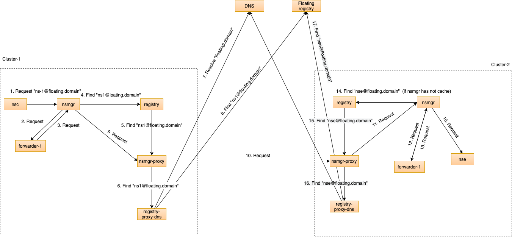

# Basic floating interdomain examples

### Floating interdomain

Basic floating interdomain examples includes the next setup:



### Interdomain
Interdomain tests can be on two clusters, for thus tests scheme of request will look as:


## Requires

- [Load balancer](./loadbalancer)
- [Interdomain-DNS](./dns)
- [Interdomain-spire](./spire)

## Includes

- [Kernel to VXLAN to Kernel Connection](./usecases/Kernel2Vxlan2Kernel)
- [Kernel to VXLAN to Kernel Connection via floating registry](./usecases/FloatingKernel2Vxlan2Kernel)

## Run

**1. Apply deployments for cluster1:**

```bash
export KUBECONFIG=$KUBECONFIG1
```

```bash
kubectl create ns nsm-system
```

Create nsmgr-proxy patch:
```bash
cat > patch-nsmgr-proxy.yaml <<EOF
---
apiVersion: apps/v1
kind: Deployment
metadata:
  name: nsmgr-proxy
spec:
  template:
    metadata:
      annotations:
        spiffe.io/federatesWith: nsm.cluster2,nsm.cluster3
EOF
```

Create registry-proxy patch:
```bash
cat > patch-registry-proxy-dns.yaml <<EOF
---
apiVersion: apps/v1
kind: Deployment
metadata:
  name: registry-proxy
spec:
  template:
    metadata:
      annotations:
        spiffe.io/federatesWith: nsm.cluster2,nsm.cluster3
EOF
```

Create registry-memory patch:
```bash
cat > patch-registry-memory.yaml <<EOF
---
apiVersion: apps/v1
kind: Deployment
metadata:
  name: registry
spec:
  template:
    metadata:
      annotations:
        spiffe.io/federatesWith: nsm.cluster2,nsm.cluster3
EOF
```

Apply NSM resources for basic tests:
```bash
kubectl apply -k https://github.com/networkservicemesh/deployments-k8s/examples/interdomain?ref=1b6733635af1969459db80647a20bf4c3b63fd94
```

**2. Apply deployments for cluster2:**

```bash
export KUBECONFIG=$KUBECONFIG2
```

```bash
kubectl create ns nsm-system
```

Create nsmgr-proxy patch:
```bash
cat > patch-nsmgr-proxy.yaml <<EOF
---
apiVersion: apps/v1
kind: Deployment
metadata:
  name: nsmgr-proxy
spec:
  template:
    metadata:
      annotations:
        spiffe.io/federatesWith: nsm.cluster1,nsm.cluster3
EOF
```

Create registry-proxy patch:
```bash
cat > patch-registry-proxy-dns.yaml <<EOF
---
apiVersion: apps/v1
kind: Deployment
metadata:
  name: registry-proxy
spec:
  template:
    metadata:
      annotations:
        spiffe.io/federatesWith: nsm.cluster1,nsm.cluster3
EOF
```

Create registry-memory patch:
```bash
cat > patch-registry-memory.yaml <<EOF
---
apiVersion: apps/v1
kind: Deployment
metadata:
  name: registry
spec:
  template:
    metadata:
      annotations:
        spiffe.io/federatesWith: nsm.cluster1,nsm.cluster3
EOF
```

Apply NSM resources for basic tests:

```bash
kubectl apply -k https://github.com/networkservicemesh/deployments-k8s/examples/interdomain?ref=1b6733635af1969459db80647a20bf4c3b63fd94
```


**3. Apply deployments for cluster3:**

```bash
export KUBECONFIG=$KUBECONFIG3
```

```bash
kubectl create ns nsm-system
```

Create registry-k8s patch:
```bash
cat > ./registry-k8s-kustomization/patch-registry-k8s.yaml <<EOF
---
apiVersion: apps/v1
kind: Deployment
metadata:
  name: registry-k8s
spec:
  template:
    metadata:
      annotations:
        spiffe.io/federatesWith: nsm.cluster1,nsm.cluster2
EOF
```

Apply NSM resources for basic tests:

```bash
kubectl apply -k https://github.com/networkservicemesh/deployments-k8s/apps/registry-k8s?ref=1b6733635af1969459db80647a20bf4c3b63fd94
```

## Cleanup

To free resouces follow the next command:

```bash
export KUBECONFIG=$KUBECONFIG1 && kubectl delete ns nsm-system
```
```bash
export KUBECONFIG=$KUBECONFIG2 && kubectl delete ns nsm-system
```
```bash
export KUBECONFIG=$KUBECONFIG3 && kubectl delete ns nsm-system
```
