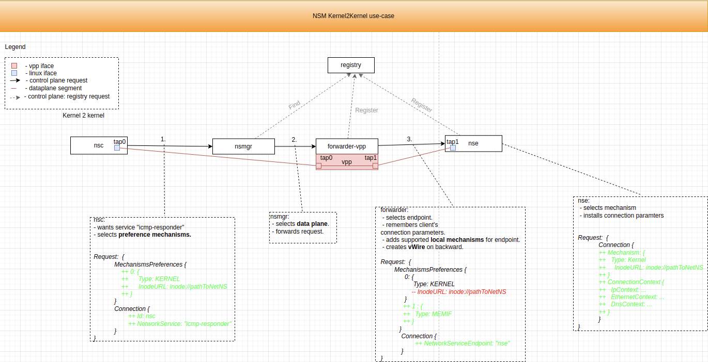

# Test kernel to kernel connection


This example shows that NSC and NSE on the one node can find each other. 

NSC and NSE are using the `kernel` mechanism to connect to its local forwarder.


Diagram:




## Requires

Make sure that you have completed steps from [basic](../../basic) or [memory](../../memory) setup.

## Run

Create test namespace:
```bash
NAMESPACE=($(kubectl create -f https://raw.githubusercontent.com/networkservicemesh/deployments-k8s/927e80b298ca20bc2efff6be09cb1e12de48ac55/examples/use-cases/namespace.yaml)[0])
NAMESPACE=${NAMESPACE:10}
```

Select node to deploy NSC and NSE:
```bash
NODE=($(kubectl get nodes -o go-template='{{range .items}}{{ if not .spec.taints  }}{{index .metadata.labels "kubernetes.io/hostname"}} {{end}}{{end}}')[0])
```

Create customization file:
```bash
cat > kustomization.yaml <<EOF
---
apiVersion: kustomize.config.k8s.io/v1beta1
kind: Kustomization

namespace: ${NAMESPACE}

resources: 
- client.yaml
bases:
- https://github.com/networkservicemesh/deployments-k8s/apps/nse-kernel?ref=927e80b298ca20bc2efff6be09cb1e12de48ac55

patchesStrategicMerge:
- patch-nse.yaml
EOF
```

Create Client:
```bash
cat > client.yaml <<EOF
---
apiVersion: v1
kind: Pod
metadata:
  name: alpine
  labels:
    app: alpine    
  annotations:
    networkservicemesh.io: kernel://icmp-responder/nsm-1
spec:
  containers:
  - name: alpine
    image: alpine:3.15.0
    imagePullPolicy: IfNotPresent
    stdin: true
    tty: true
  nodeName: ${NODE}
EOF
```

Create NSE patch:
```bash
cat > patch-nse.yaml <<EOF
---
apiVersion: apps/v1
kind: Deployment
metadata:
  name: nse-kernel
spec:
  template:
    spec:
      containers:
        - name: nse
          env:
            - name: NSM_CIDR_PREFIX
              value: 172.16.1.100/31
      nodeName: ${NODE}
EOF
```

Deploy NSC and NSE:
```bash
kubectl apply -k .
```

Wait for applications ready:
```bash
kubectl wait --for=condition=ready --timeout=1m pod -l app=alpine -n ${NAMESPACE}
```
```bash
kubectl wait --for=condition=ready --timeout=1m pod -l app=nse-kernel -n ${NAMESPACE}
```

Find nsc and nse pods by labels:
```bash
NSC=$(kubectl get pods -l app=alpine -n ${NAMESPACE} --template '{{range .items}}{{.metadata.name}}{{"\n"}}{{end}}')
```
```bash
NSE=$(kubectl get pods -l app=nse-kernel -n ${NAMESPACE} --template '{{range .items}}{{.metadata.name}}{{"\n"}}{{end}}')
```

Ping from NSC to NSE:
```bash
kubectl exec ${NSC} -n ${NAMESPACE} -- ping -c 4 172.16.1.100
```

Ping from NSE to NSC:
```bash
kubectl exec ${NSE} -n ${NAMESPACE} -- ping -c 4 172.16.1.101
```

## Cleanup

Delete ns:
```bash
kubectl delete ns ${NAMESPACE}
```
